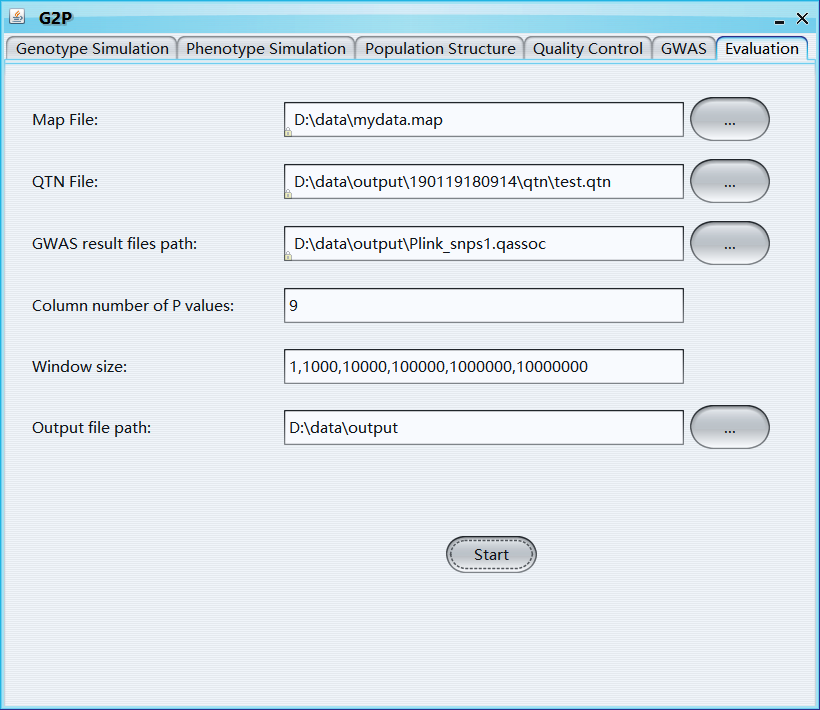

# G2P [](https://github.com/XiaoleiLiuBio/G2P/issues) [](https://github.com/XiaoleiLiuBio/G2P/commits/master)

## A Genome-Wide-Association-Study Simulation Tool for [G](https://github.com/XiaoleiLiuBio/G2P)enotype Simulation, [P](https://github.com/XiaoleiLiuBio/G2P)henotype Simulation, and [P](https://github.com/XiaoleiLiuBio/G2P)ower Evaluation

<p align="center">
<a href="https://raw.githubusercontent.com/XiaoleiLiuBio/G2P/master/results/G2P_logo.png">

</a>
</p>

### Authors:

> You Tang and ***Xiaolei Liu***

### Contact:
> [xiaoleiliu@mail.hzau.edu.cn](Xiaolei Liu)

### Contents
<!-- TOC updateOnSave:false -->

- [Installation](#installation)
    - [Environment Setup](#environment-setup)
    - [Windows](#windows)
    - [MAC](#mac)
    - [Linux](#linux)
- [Data Preparation](#data-preparation)
    - [ped](#ped)
    - [map](#map)
    - [pop](#pop)
- [Genotype Simulation](#genotype-simulation)
    - [Single Population _ GUI](#single-population-_-gui)
    - [Single Population _ Pipeline](#single-population-_-pipeline)
    - [Multi Populations _ GUI](#multi-populations-_-gui)
    - [Multi Populations _ Pipeline](#multi-populations-_-pipeline)
    - [Random Simulation _ GUI](#random-simulation-_-gui)
    - [Random Simulation _ Pipeline](#random-simulation-_-pipeline)
- [Phenotype Simulation](#phenotype-simulation)
    - [Phenotype _ GUI](#phenotype-_-gui)
    - [Phenotype _ Pipeline](#phenotype-_-pipeline)
- [Population Structure](#population-_-structure)
    - [Population structure _ GUI](#population-structure-_-gui)
    - [Population structure _ Pipeline](#population-structure-_-pipeline)
- [Quality Control](#quality-_-control)
    - [Quality control _ GUI](#quality-control-_-gui)
    - [Quality control _ Pipeline](#quality-control-_-pipeline)
- [GWAS](#gwas)
    - [GWAS _ GUI](#gwas-_-gui)
    - [GWAS _ Pipeline](#gwas-_-pipeline)
- [Method Evaluation](#method-evaluation)
    - [Method Evaluation _ GUI](#method-evaluation-_-gui)
    - [Method Evaluation _ Pipeline](#method-evaluation-_-pipeline)
- [FAQ and Hints](#faq-and-hints)

<!-- /TOC -->

---
# Installation
**[back to top](#contents)**  

## Environment Setup
**[back to top](#contents)**  
**JDK1.8 should be installed and environment variables must be configured before using G2P (http://www.oracle.com/technetwork/java/javase/downloads/jdk8-downloads-2133151.html)**  
## Windows  
**[back to top](#contents)**  
**GUI**  
Download all files from https://github.com/XiaoleiLiuBio/G2P/tree/master/gG2P_win_64 and double click the .jar file  
**Pipeline**  
Download all files from https://github.com/XiaoleiLiuBio/G2P/tree/master/kG2P_win_64  
## Mac  
**[back to top](#contents)**  
**GUI**  
Download all files from https://github.com/XiaoleiLiuBio/G2P/tree/master/gG2P_mac and double click the .jar file  
**Pipeline**  
Download all files from https://github.com/XiaoleiLiuBio/G2P/tree/master/kG2P_mac  
*permission setting*  
```bash
$ chmod 777 gemma oldplink plink  
```
## Linux  
**[back to top](#contents)**  
**GUI**  
Download all files from https://github.com/XiaoleiLiuBio/G2P/tree/master/gG2P_linux_x86_64 
and run 
```bash
$ Java -jar gG2P.jar  
```
**Pipeline**  
Download all files from https://github.com/XiaoleiLiuBio/G2P/tree/master/kG2P_linux_x86_64  
*permission setting*  
```bash
$ chmod 777 gemma oldplink plink  
```

# Data Preparation
*All files should be prepared with the same prefix*
## ped  
*details see http://zzz.bwh.harvard.edu/plink/data.shtml#ped*  
**[back to top](#contents)** 

|Family ID|Individual ID|Father ID|Mother ID|Sex|Trait|marker 1|marker 2|marker 3|marker 4|marker 5|marker 6|
| :---: | :---: |:---: |:---: |:---: |:---: |:---: |:---: |:---: |:---: |:---: |:---: |
|1|33-16|	0|	0|	0|	2|	0 0|	A A|	A A|	A G|	A G|	A G|
|1|38-11|	0|	0|	0|	2|	0 0|	A G|	A G|	A A|	A G|	A G|
|1|4226	|	0|	0|	0|	2|	0 0|	A G|	A A|	A A|	A G|	A G|
|1|4722|	0|	0|	0|	2|	0 0|	A G|	A G|	A A|	A G|	A G|
|1|A188	|	0|	0|	0|	2|	0 0|	A A|	A A|	A A|	A G|	A G|
|1|A214N|	0|	0|	0|	2|	0 0|	A G|	A A|	A G|	A A|	A G|
|1|A239	|	0|	0|	0|	2|	0 0|	A A|	A A|	A G|	A G|	A A|

|Family ID|Individual ID|Father ID|Mother ID|Sex|Trait|marker 1|marker 2|marker 3|marker 4|marker 5|marker 6|
| :---: | :---: |:---: |:---: |:---: |:---: |:---: |:---: |:---: |:---: |:---: |:---: |
|1|33-16|	0|	0|	0|	2|	0 0|	1 1|	1 1|	1 3|	1 3|	1 3|
|1|38-11|	0|	0|	0|	2|	0 0|	1 3|	1 3|	1 1|	1 3|	1 3|
|1|4226	|	0|	0|	0|	2|	0 0|	1 3|	1 1|	1 1|	1 3|	1 3|
|1|4722|	0|	0|	0|	2|	0 0|	1 3|	1 3|	1 1|	1 3|	1 3|
|1|A188	|	0|	0|	0|	2|	0 0|	1 1|	1 1|	1 1|	1 3|	1 3|
|1|A214N|	0|	0|	0|	2|	0 0|	1 3|	1 1|	1 3|	1 1|	1 3|
|1|A239	|	0|	0|	0|	2|	0 0|	1 1|	1 1|	1 3|	1 3|	1 1|

## map  
*details see http://zzz.bwh.harvard.edu/plink/data.shtml#map*  
**[back to top](#contents)** 

|Chromosome ID|Marker ID|Genetic Distance|Physical Distance|
| :---: | :---: |:---: |:---: |
|1|	PZB00859.1|	0|	157104|
|1|	PZA01271.1|	0|	1947984|
|1|	PZA03613.2|	0|	2914066|
|1|	PZA03613.1|	0|	2914171|
|1|	PZA03614.2|	0|	2915078|
|1|	PZA03614.1|	0|	2915242|
|1|	PZA00258.3|	0|	2973508|

## pop  
**[back to top](#contents)**  
*new samples will be generated using samples within sub-population*

|Sample ID|sub-Population ID|
| :---: | :---: |
|33-16|	1|	
|38_11|	1|	
|4226|	1|	
|4722|	2|	
|A188|	2|	
|A214N|	2|	
|A239|	2|	
|A272|	2|	
|A441-5|	2|	
|A554|	3|	
|A556|	3|	
|A6|	3|		
|A619|	3|

## qtn
**[back to top](#contents)**  
*each column represents simulated QTNs for each phenotype*

|Phenotype 1|Phenotype 2|Phenotype 3|Phenotype 4|Phenotype 5|
| :---: | :---: | :---: | :---: | :---: |
|66	|67	|80	|83	|90|
|9	|15	|52	|59	|135|
|90	|96	|143	|147	|174|
|3	|3	|15	|58	|89|
|89	|118	|185	|203	|212|
|69	|72	|72	|84	|110|
|46	|59	|125	|204	|207|
|14	|15	|19	|29	|39|
|9	|23	|65	|111	|131|
|19	|52	|74	|179	|194|

# Genotype Simulation  

## Single Population _ GUI  
**[back to top](#contents)** 

<p align="center">
<a href="https://raw.githubusercontent.com/XiaoleiLiuBio/G2P/master/results/Single Population.png">

</a>
</p>

```
Ped: ped file
Map: map file
Path for output Ped/Map: path for output ped and map file
Block: Yes or No, if "Yes", the whole genome will be divided into blocks and shuffled to generate new samples
Number of SNPs in each block: Number of SNPs in each block
Mutation rate: the frequency of new mutations
Imputation: if TRUE, major allele will be used to impute missing values
Population size: simulated sample size
```

## Single Population _ Pipeline
**[back to top](#contents)** 

### Windows
```
java -jar kG2P.jar --ped D:\data\AG.ped --map D:\data\AG.map --outgen D:\data\output --rn 100 --block 4 –impute
java -jar kG2P.jar --ped D:\data\AG.ped --map D:\data\AG.map --outgen D:\data\output --rn 100 --block 4 --mutation 0.0001 --impute
```

### Linux/Mac
```
java -jar kG2P.jar --ped /root/data/AG.ped --map /root/data/AG.map --outgen /root/data/output --rn 100 --block 4 –impute
java -jar kG2P.jar --ped /root/data/AG.ped --map /root/data/AG.map --outgen /root/data/output --rn 100 --mutation 0.0001
java -jar kG2P.jar --ped D:\data\AG.ped --map D:\data\AG.map --outgen D:\data\output --rn 100 --block 4
java -jar kG2P.jar --ped D:\data\AG.ped --map D:\data\AG.map --outgen D:\data\output --rn 100 --impute
java -jar kG2P.jar --ped D:\data\AG.ped --map D:\data\AG.map --outgen D:\data\output --rn 100
java -jar kG2P.jar --ped D:\data\AG.ped --map D:\data\AG.map --outgen D:\data\output --rn 100 --mutation 0.0001
```

```
jar: executive software
ped: ped file
map: map file
outgen: output path
block: number of SNPs in each block
rn: simulated sample size
impute: if 'impute' is added, major allele will be used to impute missing value
mutation: the frequency of new mutations
```

## Multi Populations _ GUI
**[back to top](#contents)** 

<p align="center">
<a href="https://raw.githubusercontent.com/XiaoleiLiuBio/G2P/master/results/Multi Populations.png">

</a>
</p>

```
Ped: ped file
Map: map file
Pop: pop file
Path for output Ped/Map: path for output ped and map file
Block: Yes, or No, if "Yes", the whole genome will be divided into blocks and shuffled to generate new samples
Number of SNPs in each block: Number of SNPs in each block
Mutation rate: the frequency of new mutations
Migration rate: the ratio of immigrants (or emigrants) for each group
Genetic drift: is the change in the frequency of an existing gene variant (allele) in a population due to random sampling of organisms
Imputation: if TRUE, major allele will be used to impute missing values
Sample size of each population: sample size of each newly simulated population 
Population size: number or vector, simulated sample size
```

## Multi Populations _ Pipeline
**[back to top](#contents)** 

### Windows
```
java -jar kG2P.jar --ped D:\data\AG.ped –map D:\data\AG.map --pop D:\data\AG.pop --outgen D:\data\output --block 4 --rn 100
java -jar kG2P.jar --ped D:\data\AG.ped --map D:\data\AG.map --pop D:\data\AG.pop --outgen D:\data\output --block 4 --rn 100 --mutation 0.0001 --mig 0.1 --genetic 0.001
```

### Linux/Mac
```
java -jar kG2P.jar --ped /root/data/AG.ped --map /root/data/AG.map --pop /root/data/AG.pop --outgen /root/data/output --impute --block 4 --rn 100
java -jar kG2P.jar --ped /root/data/AG.ped --map /root/data/AG.map --pop /root/data/AG.pop --outgen /root/data/output --rn 100 --mutation 0.0001 --mig 0.1 --genetic 0.001
java -jar kG2P.jar --ped /root/data/AG.ped --map /root/data/AG.map --pop /root/data/AG.pop --outgen /root/data/output --rn 100 --genetic 0.001
java -jar kG2P.jar --ped D:\data\AG.ped --map D:\data\AG.map --pop D:\data\AG.pop --outgen D:\data\output --block 4 --rn 100
java -jar kG2P.jar --ped D:\data\AG.ped --map D:\data\AG.map --pop D:\data\AG.pop --outgen D:\data\output --rn 100
java -jar kG2P.jar --ped D:\data\AG.ped --map D:\data\AG.map --pop D:\data\AG.pop --outgen D:\data\output --impute --rn 100
java -jar kG2P.jar --ped D:\data\AG.ped --map D:\data\AG.map --pop D:\data\AG.pop --outgen D:\data\output --impute --block 4 --rn 100,200,300,400
java -jar kG2P.jar --ped D:\data\AG.ped --map D:\data\AG.map --pop D:\data\AG.pop --outgen D:\data\output --block 4 --rn 100,200,300,400
java -jar kG2P.jar --ped D:\data\AG.ped --map D:\data\AG.map --pop D:\data\AG.pop --outgen D:\data\output --rn 100,200,300,400
java -jar kG2P.jar --ped D:\data\AG.ped --map D:\data\AG.map --pop D:\data\AG.pop --outgen D:\data\output --impute --rn 100,200,300,400
java -jar kG2P.jar --ped D:\data\AG.ped --map D:\data\AG.map --pop D:\data\AG.pop --outgen D:\data\output --rn 100 --mutation 0.0001 --mig 0.1 --genetic 0.001
java -jar kG2P.jar --ped D:\data\AG.ped --map D:\data\mydata.map --pop D:\data\mydata.pop --outgen D:\data\output –-rn 100 --genetic 0.003
```

```
jar: executive software
ped: ped file
map: map file
pop: pop file
outgen: output path
block: number of SNPs in each block
rn: simulated sample size
mutation: the frequency of new mutations
mig: the ratio of immigrants (or emigrants) for each group
genetic: genetic drift, which is the change in the frequency of an existing gene variant (allele) in a population due to random sampling of organisms
impute: if 'impute' is added, major allele will be used to impute missing values
```

## Random Simulation _ GUI
**[back to top](#contents)** 

<p align="center">
<a href="https://raw.githubusercontent.com/XiaoleiLiuBio/G2P/master/results/Random Populations.png">

</a>
</p>

```
Number of Chromosomes: total number of Chromosomes for each newly simulated sample
Marker size of each Chromosome: a vector, marker size of each Chromosome
Heterozygosity: average heterozygosity of all markers
Population size: Sample size of new generated population
Fst: fixation index
Physical distance of neighbor markers: Physical distance between neighbor markers
Output ped file path: output path of ped file
```

## Random Simulation _ Pipeline
**[back to top](#contents)** 

### Windows
```
java -jar kG2P.jar --sample 100 --chr 5 --marker 100,200,300,400,500 --d 500 --outgen D:\data\output
java -jar kG2P.jar --sample 100 --chr 5 --marker 100,200,300,400,500 --d 500 --outgen D:\\data\\output --Heter 0.5 --Fst 0.05,0.15,0.2
```

### Linux/Mac
```
java -jar kG2P.jar --sample 100 --chr 5 --marker 100,200,300,400,500 --d 500 --outgen /root/data/output
java -jar kG2P.jar --sample 100 --chr 5 --marker 100,200,300,400,500 --d 500 --outgen /root/data/output --Heter 0.5 --Fst 0.05,0.15,0.2
```

```
jar: executive software
sample: simulated sample size
chr: Number of Chromosomes
marker: SNP markers for each Chromosome
d: physical distance (base pairs) between nearby markers
outgen: output path
Heter: average heterozygosity of all markers
Fst: fixation index
```

# Phenotype Simulation  
**[back to top](#contents)**  
## Phenotype _ GUI

### Normal distribution
<p align="center">
<a href="https://raw.githubusercontent.com/XiaoleiLiuBio/G2P/master/results/Simulate Phenotype-normal.png">

</a>
</p>

### Geometry distribution
<p align="center">
<a href="https://raw.githubusercontent.com/XiaoleiLiuBio/G2P/master/results/Simulate Phenotype-geometry.png">

</a>
</p>

```
Ped file path: path of ped file
QTN area: the genomic area that used to select QTNs
Range: if 'QTN area' is 'Yes', 'range' can be used to set the 'QTN area'
Effect type: three options for QTN effect type, including A, A+D, A+D+A/D, A represents Additive effect and D represents Dominance effect
Distribution of QTN effects: two options, 'Normal' and 'Geometry'
Mean: mean value of the normal distribution, length of 'Mean' should be the same with 'Variance'
Variance: variance of the normal distribution
Formats: phenotype formats of 'GEMMA', 'Plink', and 'FaST-LMM' soft wares
Trait type: quantitative or category
Summary statistics: output the summary statistics information of simulated phenotypes, includes QTN ID, Chromosome, Physical Position, effects of additive, dominance, and additive-dominance interaction, and heritability 
Number of simulated phenotypes: number of simulated phenotypes
Number of QTNs: number of QTNs, if it is a vector, effect of different QTN group will follow different distributions; length of nqtn, m, and v should be same
Heritability: heritability, a vector with length equals to number of ‘Effect type’
Output file path: output file path
```

## Phenotype _ Pipeline
### Windows
```
java -jar kG2P.jar --ped D:\data\AG.ped --outgen D:\data\output --rep 100 --dis geo 0.99 --h2 0.5 --nqtn 100 --QTNarea 1-500,1000-1500
java -jar kG2P.jar --ped D:\data\AG.ped --outgen D:\data\output --rep 10 --dis geo 0.99,0.88,0.77 --h2 0.3,0.1,0.05 --nqtn 80,40,20 --QTNarea 1-500,1000-1500 --effect A/D --category 2 --summary
```

### Linux/Mac
```
java -jar kG2P.jar --ped /root/data/AG.ped --outgen /root/data/output --rep 100 --dis geo 0.99 --h2 0.5 --nqtn 100 --QTNarea 1-500,1000-1500
java -jar kG2P.jar --ped D:\data\AG.ped --outgen D:\data\Part2out --rep 100 --dis geo 0.99 --h2 0.5 --nqtn 100
java -jar .\kG2P.jar --ped D:\data\AG.ped --outgen D:\data\output --rep 10 --dis geo 0.99,0.88 --h2 0.5 --nqtn 10,20 --QTNarea 1-500,1000-1500
java -jar KG2P.jar --ped D:\data\AG.ped --outgen D:\data\Part2out --rep 100 --dis nor --m 0,0.1 --v 0.99,0.98 --h2 0.5 --nqtn 10,20 --QTNarea 1-500,1000-1500
java -jar kG2P.jar --ped /root/data/AG.ped --outgen /root/data/output --rep 10 --dis geo 0.99,0.88 --h2 0.3,0.1 --nqtn 80,40 --effect D --category 4
java -jar kG2P.jar --ped /root/data/AG.ped --outgen /root/data/output --rep 10 --dis nor --h2 0.5 --m 0 --v 0.99 --nqtn 100 --effect A --category 2
java -jar kG2P.jar --ped /root/data/AG.ped --outgen /root/data/output --rep 10 --dis nor --h2 0.3 --m 0.2 --v 0.88 --nqtn 100 –summary
java -jar kG2P.jar --ped /root/data/AG.ped --outgen /root/data/output --rep 10 --dis nor --h2 0.5 --m 0 --v 0.99 --nqtn 100 --effect A/D --category 2
```

```
jar: executive software
rep: number of simulated phenotypes
dis: distribution of QTN effects, two options, 'nor' and 'geo'
m: mean value of the normal distribution
v: variance of the normal distribution
QTNarea: the genomic area that used to select QTNs
h2: heritability
nqtn: number of QTNs, if it is a vector, the effects of different QTN groups will follow different distributions, and the length of nqtn, m, and v should be same
effect: three options for QTN effect type, including A (A), A+D (D), A+D+A/D (A/D)
category: number of categories for simulated phenotypes
```

# Population Structure 
**[back to top](#contents)**  
## Population structure _ GUI

<p align="center">
<a href="https://raw.githubusercontent.com/XiaoleiLiuBio/G2P/master/results/Population Structure.png">

</a>
</p>

```
Genotype (bed/bim/fam, ped/map): select genotype file
PCA: select if you want to calculate principle components
Number of PCs: number of PCs will be calculated and generated
Kinship: select if you want to calculate Kinship matrix
```

## Population structure _ Pipeline
### PC _ Windows
```
java -jar kG2P.jar --pre "plink --bfile D:\data\AG --pca 3 --out D:\data\AG"
```
### PC _ Linux/Mac
```
java -jar kG2P.jar --pre "./plink --bfile /root/data/AG --pca 3 --out /root/data/AG"
```

### Kinship _ Linux/Mac
```
java -jar kG2P.jar --pre "./gemma -bfile /root/data/AG -gk -o testgemma"
```

```
jar: executive software
pre: pipeline of the software you want to use, attention that the software should be put in the same path as kG2P.jar
```

# Quality Control 
**[back to top](#contents)**  
## Quality control _ GUI

<p align="center">
<a href="https://raw.githubusercontent.com/XiaoleiLiuBio/G2P/master/results/Quality Control.png">

</a>
</p>

```
Merge: merge multiple selected genotype file
Ped file path: path of ped file
Marker call rate: filters out all markers with missing call rates exceeding the provided value
Individual call rate: filters out all individuals with missing call rates exceeding the provided value
MAF: threshold of minor allele frequency
HWE: Hardy-Weinberg equilibrium test p-value threshold
Output file format: the format of output genotype file
```

## Quality control _ Pipeline
### Merge _ Windows
```
java -jar kG2P.jar --mergePED D:\data\mydata1.ped D:\data\mydata2.ped
```
### Merge _ Linux/Mac
```
java -jar kG2P.jar --mergePED /root/data/mydata1.ped /root/data/mydat2.ped
```

### QC _ Windows
```
java -jar .\kG2P.jar --ped "D:\data\mydata.ped" --geno 0.1 --mind 0.1 --maf 0.05 --hwe 0 --format pbv
java -jar .\kG2P.jar --ped "D:\data\mydata.ped" --geno 0.1 --mind 0.1 --maf 0.05 --hwe 0 --format b
```

### QC _ Linux/Mac
```
java -jar ./kG2P.jar --ped /root/data/mydata.ped --geno 0.1 --mind 0.1 --maf 0.05 --hwe 0 --format pbv
java -jar kG2P.jar --ped /root/data/mydata.ped --geno 0.1 --mind 0.1 --maf 0.08 --hwe 0 --format bv
```

```
jar: executive software
mergePED: merge multiple genotype files prepared in ped format
geno: filters out all markers with missing call rates exceeding the provided value
mind: filters out all individuals with missing call rates exceeding the provided value
maf: threshold of minor allele frequency
hwe: Hardy-Weinberg equilibrium test p-value threshold
format: three options, including p(ped/map), b(bed/bim/fam), and v(vcf)
```

# GWAS  
**[back to top](#contents)**  
## GWAS _ GUI

<p align="center">
<a href="https://raw.githubusercontent.com/XiaoleiLiuBio/G2P/master/results/GWAS.png">

</a>
</p>

```
Genotype (bed/bim/fam, ped/map): select genotype file
Phenotype file path: select the first phenotype file, all phenotypes in the same path will be analyzed one by one; name of the phenotype file must include a continuous order number, e.g., 'phenotype1.txt', 'phenotype2.txt', 'phenotype3.txt'
Results output file path: select output file path
Command: command for running gwas of the first phenotype, user-specific covariates files and kinship file can be also included in the command line, note that the output file name must be ‘g2ptemp’
```

```
R package _ Windows
Take FarmCPU (an R package) as an example:
Download and install essential packages for FarmCPU from http://www.zzlab.net/FarmCPU/index.html;
If the script for running FarmCPU is stored in Demo_script.R and the path of Rscript.exe is "E:\R\R-3.4.0\bin\x64\Rscript.exe", the command line should be written as: E:\R\R-3.4.0\bin\x64\Rscript.exe Demo_script.R
```

## GWAS _ Pipeline
### Plink _ Windows
```
java -jar kG2P.jar --GWAS "plink --bfile D:\data\AG --fam D:\data\out\171104010413\Plink\Plink_snps1.fam --assoc --out D:\data\g2ptemp" --sp Plink_snps1.fam
```
### Plink _ Linux/Mac
```
java -jar kG2P.jar --GWAS "./plink --bfile /root/data/AG --fam /root/data/output/171104010413/Plink/Plink_snps1.fam --assoc --out /root/data/g2ptemp" --sp Plink_snps1.fam
```
### Gemma _ Linux/Mac
```
java -jar kG2P.jar --GWAS "./gemma -bfile /root/data/AG -p /root/data/out/171104030401/GEMMA/GEMMA_phenotype1.txt -k /root/output/testgemma.cXX.txt -lmm 4 -o g2ptemp" --sp GEMMA_phenotype1.txt
jar: executive software
GWAS: command line used for running gwas of the first phenotype
sp: the first phenotype file, the file path is not needed
```

```
jar: executive software
GWAS: command line used for running gwas of the first phenotype
sp: the first phenotype file, the file path is not needed
```

# Method Evaluation
**[back to top](#contents)**  
## Method Evaluation _ GUI

<p align="center">
<a href="https://raw.githubusercontent.com/XiaoleiLiuBio/G2P/master/results/Evaluation.png">

</a>
</p>

```
Map file: map file
QTN file: qtn file
GWAS result files path: path of gwas results
Column number of P values: column number of P values
Window size: A window is considered to be identified if a positive genetic marker is detected within the window
Output file path: output path of power/fdr evaluation results
```

## Method Evaluation _ Pipeline
### Evaluation of the methods in Plink _ Windows
```
java -jar kG2P.jar --map D:\data\AG.map --qtn D:\data\output\170106093742\qtn\test.qtn --gwas D:\data\output\Plink_snps1.qassoc --pv 9 --out D:\data\output
java -jar kG2P.jar --map D:\data\AG.map --qtn D:\oldoutput\190120151328\qtn\test.qtn --gwas D:\oldoutput\Plink_snps1.qassoc --pv 9 --out D:\data\output --WS 2,2000,200000,200000000
```

### Evaluation of the methods in Plink _ Linux/Mac
```
java -jar kG2P.jar --map /root/data/AG.map --qtn /root/data/output/171104030401/qtn/test.qtn --gwas /root/data/output/Plink_snps1.qassoc --pv 9 --out /root/data/output
java -jar kG2P.jar --map /root/data/AG.map --qtn /root/data/output/171104030401/qtn/test.qtn --gwas /root/data/output/Plink_snps1.qassoc --pv 9 --out /root/data/output --WS 3,300,3000,30000,300000,3000000
```

### Evaluation of the methods in Gemma _ Linux/Mac
```
java -jar kG2P.jar --map /root/data/AG.map --qtn /root/data/output/171104030401/qtn/test.qtn --gwas /root/output/GEMMA_phenotype1.assoc.txt --pv 9 --out /root/data/output
```

```
jar: executive software
map: map file
qtn: qtn file
gwas: the first gwas result file, there is a one-to-one mapping between gwas result files and columns in the qtn file
pv: column number of P values
out: output file path
WS: Window size, a window is considered to be identified if a positive genetic marker is detected within the window
```

# Citations

```
For G2P: Hope it will be coming soon
For principle components analysis: 
    if you use plink, please cite: Purcell S, et.al. "PLINK: A Tool Set for Whole-Genome Association and Population-Based Linkage  Analyses." American Journal of Human Genetics, 81.3(2007):559-575.
For calculating kinship matrix:
    if you use gemma, please cite: Zhou, X., et.al. "Genome-wide Efficient Mixed Model Analysis for Association Studies." Nature Genetics, 44.7(2012):821.
Please cite all soft wares you used for GWAS and evaluation!
```

# FAQ and Hints
